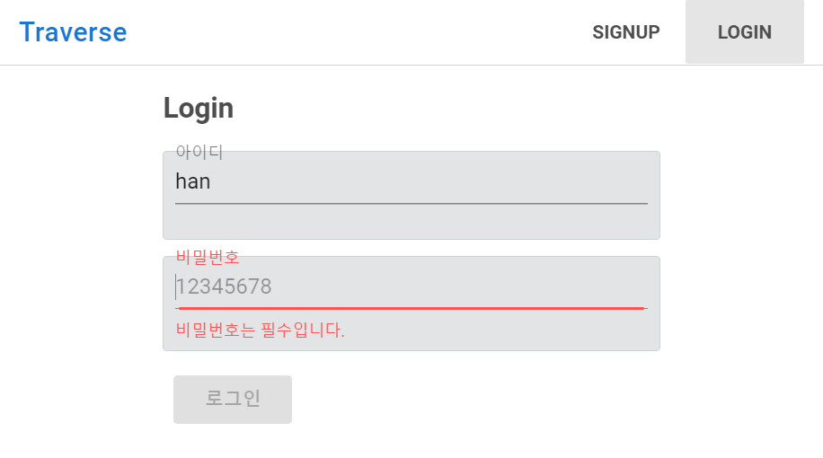
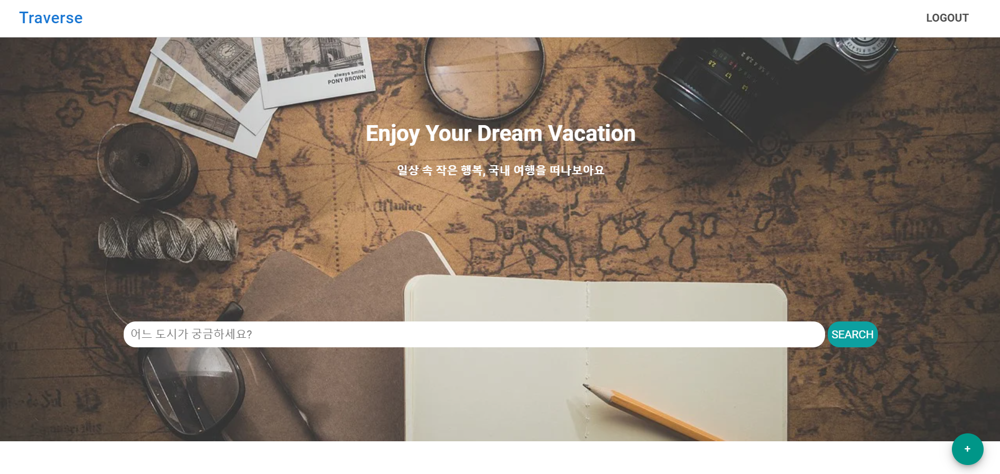
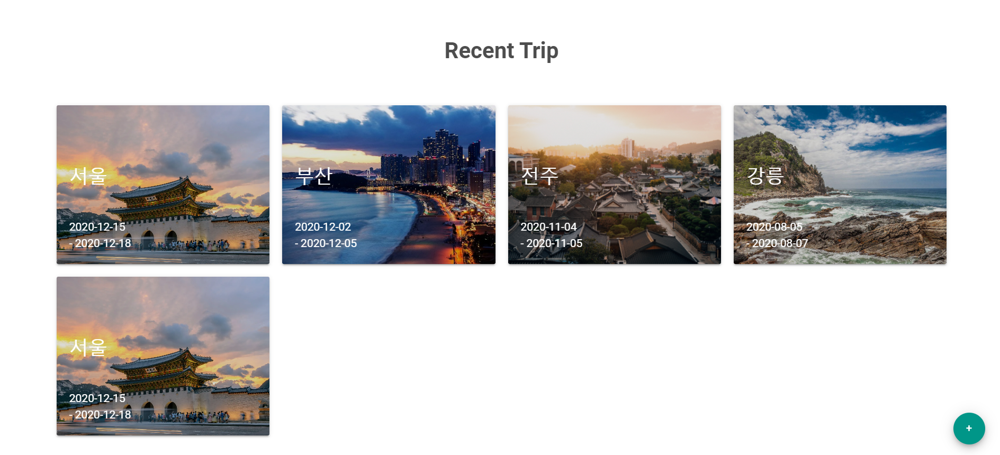
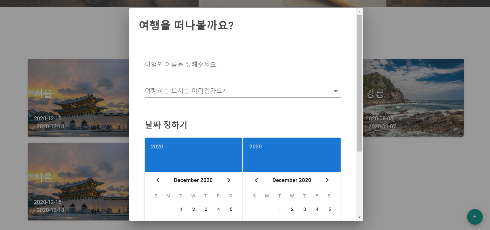
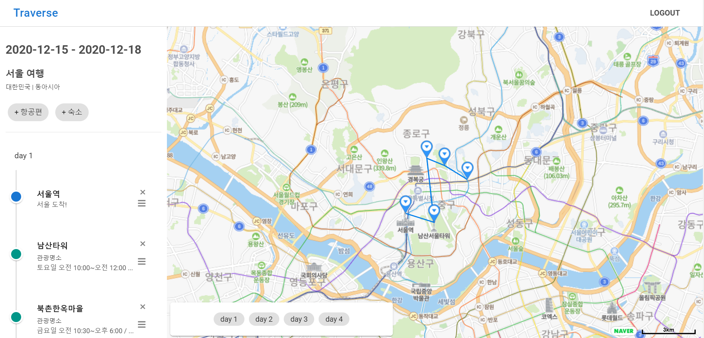
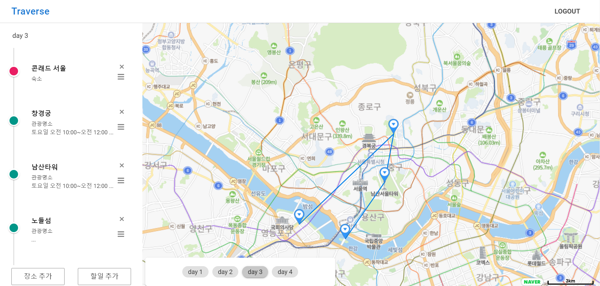
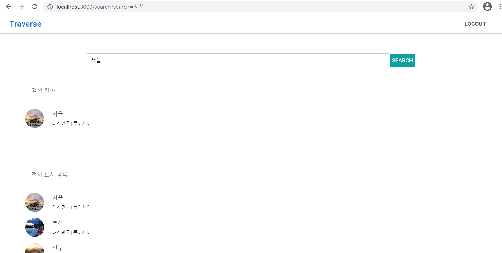
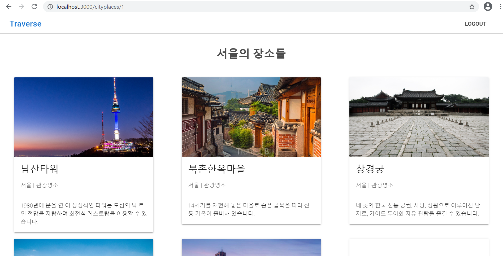
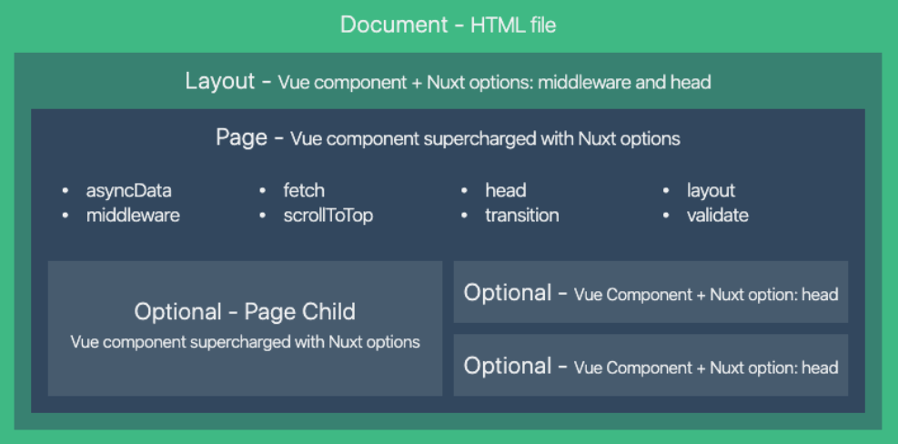
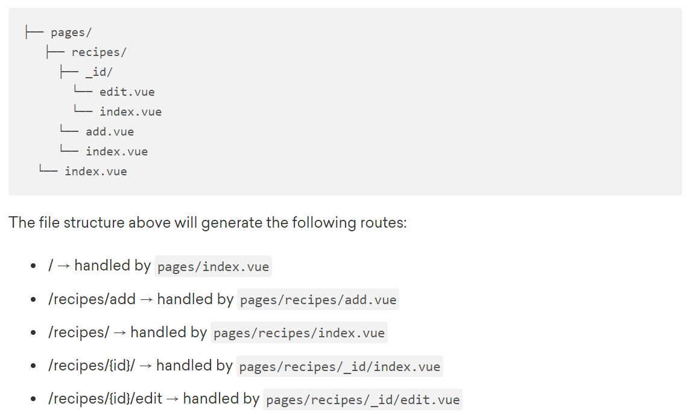

# Traverse(여행지 경로짜기)

## 목차

- [개요](#개요)

- [기능](#기능)

- [nuxt개념](#nuxt개념)

  

## 개요

#### 기간

2020.12.08 ~ 2020.12.16(?) 수정 가능


#### 목적

- 여러 여행지를 여행할 때, 지도상에서 경로를 확인하고 여행지 여행 순서 수정 가능하게 하는 반응형 웹 구현 

- nuxt.js 사용에 익숙해지고, 검색 최적화를 고려한 프로젝트 경험 쌓기


#### 유사 서비스

- 트리플


#### 역할 및 기여도

- 프론트엔드, 백엔드


#### 기술 스택

- 프론트엔드: nuxt (vue, vuex), vuetify
- 백엔드: django


## 기능

1. 로그인 & 회원가입 페이지

   - middleware 사용: 로그인 하지 않으면 다른페이지 접속 시 로그인 창으로 이동(검색 페이지 제외)

     ```javascript
     // middleware/authenticated.js
     export default function({ store, redirect }) {
         if (!store.state.users.token) {
             redirect('/login');
         }
     }
     
     // 다른 페이지들
     middleware: 'authenticated',
     ```




2. 메인페이지
   - 여행지 검색 기능
   - 사용자의 여행 목록
   - 새 여행 추가 기능






3. 여행 추가 모달 창




4. 여행 경로 페이지

   - 일정: 일정 CRUD, 드래그 앤 드롭으로 일정 순서 와 지도상의 경로 변경 가능

     ```javascript
     mounted() {
         // 드래그 앤 드롭
         const { from } = this.$refs;
         dragula([from], {
             revertOnSpill: true,
             moves: function (el, container, handle) {
                 return handle.classList.contains('handle');
             }
         }).on('drop', (el, target) => {
             // 옮긴 객체 id
             const cur = parseInt(el.getElementsByClassName('schedule__div')[0].dataset['scheduleId'])
     
             // 전, 후 찾기
             let prev = null
             let next = null
             const candidates = Array.from(target.querySelectorAll('.schedule__div'))
     
             for (let i = 0; i < candidates.length; i++) {
                 const id = parseInt(candidates[i].dataset['scheduleId'])
                 if (id === cur) {
                     if (i > 0) {
                         prev = candidates[i-1]
                     }
                     if (i < candidates.length - 1) {
                         next = candidates[i+1]
                     }
                     break;
                 }
             }
             // 전, 후 일정 order 값 기준으로 타겟 일정 order값 계산
             const targetSchedule = {
                 id: cur,
                 order: 0,
                 day: el.getElementsByClassName('schedule__div')[0].dataset['scheduleDay']
             }
     
             if (!prev && next) {
                 targetSchedule.order = parseFloat(next.dataset['scheduleOrder']) - 1
             }
             else if (!next && prev) {
                 targetSchedule.order = parseFloat(prev.dataset['scheduleOrder']) + 1
             } 
             else if (prev && next) {
                 targetSchedule.order = (parseFloat(prev.dataset['scheduleOrder']) + parseFloat(next.dataset['scheduleOrder'])) / 2 
             } 
     
             // 수정해주어야
             this.UPDATE_SCHEDULE(targetSchedule)
         });
     ```

     

   - 지도: 하단의 NavBar에서 날짜를 선택하면 해당 날짜의 여행 경로 표현

     ```javascript
     fetchMap() {
         //지도를 삽입할 HTML 요소 또는 HTML 요소의 id를 지정 후
         const mapDiv = document.getElementById('map') 
     
         let middleLat = 0
         let middleLng = 0
         let latlng = []
         let minLat = 100000
         let maxLat = 0
         let minLng = 100000
         let maxLng = 0
     
         // daySchedule을 order 값 기준으로 sort 해야
         let dayScheduleInOrder = [...this.daySchedule]
         dayScheduleInOrder.sort((a,b) => {
             return a.order < b.order ? -1 : a.order > b.order ? 1 : 0
         })
         // 좌표 뽑기
         dayScheduleInOrder.forEach(element => {
             middleLat = middleLat + element.place.lat
             middleLng = middleLng + element.place.lng
             let temp = new naver.maps.LatLng(element.place.lat, element.place.lng)
             latlng.push(temp)
     
             // 최대 최소 계산(바운더리 설정 위해)
             if (element.place.lat > maxLat) {
                 maxLat = element.place.lat
             } 
             if (element.place.lat < minLat) {
                 minLat = element.place.lat
             }
             if (element.place.lng > maxLng) {
                 maxLng = element.place.lng
             } 
             if (element.place.lng < minLng) {
                 minLng = element.place.lng
             }
         });
     
         // 중심 좌표 계산
         const tempLength = Object.keys(dayScheduleInOrder).length
         if (tempLength) {
             middleLat = middleLat / tempLength
             middleLng = middleLng / tempLength
         } else {
             middleLat = 37.56664532365792
             middleLng = 126.97793969616743
         }
         // 옵션 없이 지도 객체를 생성하면 서울 시청을 중심으로 하는 16 레벨의 지도가 생성
         // 모든 점들 다 들어오게 하려면 바운더리 설정 필요
         let maxBoundary = new naver.maps.LatLngBounds(
             new naver.maps.LatLng(minLat, minLng),
             new naver.maps.LatLng(maxLat, maxLng)
         )
     	// 점이 하나 이상이면
         if (latlng.length > 1) {
             let map = new naver.maps.Map(mapDiv, {
                 zoom: 12,
                 maxBounds: maxBoundary,
             })
     
             // 마커찍기
             let markerList = []
             for (let i=0, ii=latlng.length; i<ii; i++) {
                 let marker = new naver.maps.Marker({
                     position: latlng[i],
                     map: map,           
                 });
     
                 marker.set('seq', i)
                 markerList.push(marker)
             }  
     
             // 폴리라인 찍기(경로)
             let polyline = new naver.maps.Polyline({
                 map: map,
                 path: latlng
             })
     		// 점이 하나인 경우
             } else {
                 let map2 = new naver.maps.Map(mapDiv, {
                     zoom: 13,
                     // maxBounds: maxBoundary
                     center: new naver.maps.LatLng(middleLat, middleLng)
                 })
     
                 // 마커찍기
                 let markerList2 = []
                 for (let i=0, ii=latlng.length; i<ii; i++) {
                     let marker2 = new naver.maps.Marker({
                         position: latlng[i],
                         map: map2,           
                     });
                 }   
             }   
     },
     ```
     
     
     
   - 하단의 NavBar와 왼편의 Drawer 이동 연동
   
     ```javascript
  // store state의 dayScroll 
     watch: {
      dayScroll() {
             this.$refs[`day${this.dayScroll}`][0].$el.scrollIntoView({behavior: "smooth", inline: "nearest"})
      }
     },
     ```
   
     






5. 여행지 검색

   - 전체 도시 목록: asyncData로 ssr 도입

     ```javascript
     async asyncData({ $axios }) {
         try {
             let temp = await $axios.$get(`http://localhost:8000/api/cities`)
             let cityList = temp.results
             return { cityList }
         } catch (err) {
             return { cityList: [] }
         }
     },
     ```

     

   - 여행지 검색 결과: 검색에 따라 ajax 요청

     ```javascript
     onClickSearch() {
         const keyword = this.keyword.trim()
         if (keyword) {
             this.FETCH_CITYLIST({keyword: keyword})
             this.$router.push({ path: 'search', query: { search: keyword }})
         }
     },
     ```

     




6. 여행지 장소 목록 페이지

   - asyncData 사용

     ```javascript
     async asyncData({ $axios, params }) {
         try {
             let temp = await $axios.$get(`http://localhost:8000/api/places?city=${params.cityId}`)
             let placeList = temp.results
             return { placeList }
         } catch (err) {
             return { placeList: [] }
         }
     },
     ```

     

   - head 사용: 타이틀 수정

     ```javascript
     head() {
         return {
             title: this.placeList[0].city
         };
     },
     ```

     




## nuxt개념

1. 검색 최적화를 위하여 spa 개념에 ssr 개념을 도입

   - 특히 pages 디렉토리 내부의 컴포넌트에서는, 기존의 vue의 컴포넌트에 더해 여러가지 properties 제공

     

   - pages 내부 구조 설계

     


2. 생명주기
   - **middleware(클라이언트, 서버)** : 클라이언트와 서버 모두 훅들이 본격적으로 호출되기 전에, 앱을 만드는 과정에서 미리 정의해놓은 미들웨어들이 먼저 동작합니다. 만약 `serverMiddlware`을 정의했다면 서버 사이드에서만 렌더링 과정에서 일반 미들웨어가 동작하기 전에 먼저 동작합니다.
   - **asyncData(서버 or 클라이언트)**: 서버 혹은 클라이언트 사이드에서 생명주기 통틀어 한번씩만 호출되는 훅입니다. Vue 인스턴스의 생명주기 이전에 먼저 데이터를 가져와서 렌더링을 하고싶은 경우에 사용합니다. 컴포넌트를 로드하기 전에 항상 호출되며, 페이지 컴포넌트의 경우에만 사용할 수 있습니다. `asyncData` 의 리턴값은 Vue 인스턴스의 `data()`와 병합됩니다.
   - **beforeCreated, created(클라이언트, 서버)**: 서버에서 새로운 vue인스턴스를 생성한 뒤 이를 프리랜더링 하기 때문 Vue 인스턴스가 서버에서 만들어지는 시점에 `created`와 `beforeCreated`훅이 호출됩니다. 또한 클라이언트에서도 인스턴스를 만들고 `$mount` 메소드가 호출될 때도 따라 호출됩니다. 즉 서버와 클라이언트 사이드 양쪽에서 호출되는 훅입니다.
   - **beforeMount 이후의 훅(클라이언트)**: 클라이언트 사이드에서만, 하이드레이션 이후에 `$mount` 메소드가 호출될 때 나머지 Vue 생명주기 훅들이 실행됩니다.

